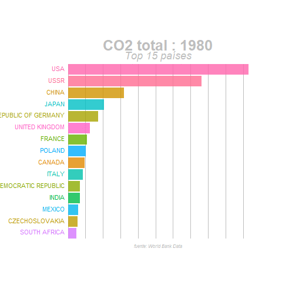

```{css, echo = FALSE}
.columns {display:flex;}
h1.title {font-size: 45px;color: forestgreen}
h1 {color: Seagreen; font-size: 35px ;font-family: Arial, Helvetica, sans-serif}
h2{color: Darkolivegreen; font-size: 28px;}
body { background-color: darkseagreen; }
a {color: green;}
.list-group-item.active, .list-group-item.active:focus, .list-group-item.active:hover {
    z-index: 2;
    color: #fff;
    background-color: olivedrab;
    border-color: palegreen;
}
.nav-pills > li.active > a, .nav-pills > li.active > a:hover, .nav-pills > li.active > a:focus {
    color:black;
    background-color: olivedrab;
}
body{
   font-family: "Lucida Console",monospace;
  font-size: 11pt;
}
```

```{r setup, include=FALSE}
knitr::opts_chunk$set(echo = FALSE)
library(tidyverse)
library(sf)
library(viridis)
library(plotly)
library(gganimate)
library(transformr)
library(wordcloud2)
library(janitor)
library(here)
#library(xaringan)
```
```{r dfs,  warning=FALSE, message=FALSE}

df_co2<- read_csv("./Datos/nation_1751_2017.csv")
temp_country <-read_csv("./Datos/GlobalLandTemperaturesByCountry.csv")
coast_vs_waste <- readr::read_csv("https://raw.githubusercontent.com/rfordatascience/tidytuesday/master/data/2019/2019-05-21/coastal-population-vs-mismanaged-plastic.csv")

mismanaged_vs_gdp <- readr::read_csv("https://raw.githubusercontent.com/rfordatascience/tidytuesday/master/data/2019/2019-05-21/per-capita-mismanaged-plastic-waste-vs-gdp-per-capita.csv")

waste_vs_gdp <- readr::read_csv("https://raw.githubusercontent.com/rfordatascience/tidytuesday/master/data/2019/2019-05-21/per-capita-plastic-waste-vs-gdp-per-capita.csv")
dco2_pc<- read_csv("./Datos/co2_pc.csv")

df_co2_2 <- df_co2[-c(1:4), ]
df_co2_2[ df_co2_2 == "." ] <- NA
 df_co2_3 <-  transform(df_co2_2, X2 = as.numeric(X2),
   X3 = as.numeric(X3),
   X4 = as.numeric(X4),
   X5 = as.numeric(X5),
   X6 = as.numeric(X6),
   X7 = as.numeric(X7),
   X8 = as.numeric(X8),
   X9 = as.numeric(X9),          
   X10 = as.numeric(X10)      
 )
 

 
df_co2_4 <- df_co2_3 %>% rename(country = `Carbon.Dioxide.emissions.from.fossil.fuel.consumption.and.cement.production.by.nation`,
  year = X2,
   total_co2 = X3 #`Total CO2 emissions from fossil-fuels and cement production (thousand metric tons of C)`
   ,
em_sf = X4, #`Emissions from solid fuel consumption` 
em_lf = X5, #`Emissions from liquid fuel consumption` 
em_gf = X6, #`Emissions from gas fuel consumption` 
em_cp = X7, #`Emissions from cement production` ,
em_gfl = X8, #`Emissions from gas flaring`
em_co2_pc = X9, #`Per capita CO2 emissions (metric tons of carbon)`
em_bf = X10 #`Emissions from bunker fuels`
)


 n_df_0 <- df_co2_4%>% select(year,country,total_co2)%>%  filter(year==2010) %>% group_by(country)%>% select(-year) %>% arrange(total_co2)
  n_df <- df_co2_4 %>% group_by(country) %>% summarise(total_co2=sum(total_co2))%>% ungroup() %>% slice_max(total_co2,n=20) %>% arrange(desc(total_co2))
  n_df2 <- df_co2_4 %>% filter(year > 2000) %>% group_by(country) %>% summarise(em_co2_pc=sum(em_co2_pc))%>% ungroup() %>% slice_max(em_co2_pc,n=40) %>% arrange(desc(em_co2_pc))
  w_df <- df_co2_4 %>% group_by(year) %>% summarise(n=sum(total_co2))%>% ungroup()
  
  


df_co2_5 <-df_co2_4 %>% group_by(country)
    
    
    


```


## Evolución de las emisiones de co2
``` {r co2, echo = FALSE, eval = TRUE, fig.align = 'center',  warning=FALSE, message=FALSE}

```

## Evolución de las emisiones de co2
``` {r co22, echo = FALSE, eval = TRUE, fig.align = 'center',  warning=FALSE, message=FALSE}

```


## Emisiones de co2 per cápita 

```{r circular, echo = FALSE, fig.align='center',  warning=FALSE, message=FALSE}
 n_df3 <- n_df2 %>% mutate(id = seq(1,40))
label_data <- n_df3
number_of_bar <- nrow(label_data)
angle <-  90 - 360 * (label_data$id-0.5) /number_of_bar 
label_data$hjust<-ifelse( angle < -90, 1, 0)
label_data$angle<-ifelse(angle < -90, angle+180, angle)
p <- ggplot(n_df3, aes(x=as.factor(id), y=em_co2_pc,fill=em_co2_pc)) +       

  geom_bar(stat="identity") +
  
 
  ylim(-100,400) +
  

  theme_minimal() +
  theme(
    axis.text = element_blank(),
    axis.title = element_blank(),
    panel.grid = element_blank(),
    plot.margin = unit(rep(-1,4), "cm")      
  ) +
  
  coord_polar(start = 0) +
  
  
  geom_text(data=label_data, aes(x=id, y=em_co2_pc, label=country, hjust=hjust), color="black", fontface="bold",alpha=0.6, size=2.5, angle= label_data$angle, inherit.aes = FALSE ) +
  scale_fill_viridis_c(option = "B", trans = "sqrt")

p
    
```

## Emisiones acumuladas por país

```{r co2_acumulat,  warning=FALSE, message=FALSE}
 h<- n_df %>% ggplot(aes(x = reorder(country, total_co2),total_co2,fill= country)) +
    geom_bar(stat = "identity") +
    theme(legend.position = "none") +
    coord_flip() + 
  labs(x = "Países" , y= " Co2 total")
  
  h
```


## Emisiones acumuladas vs per cápita

``` {r comparativa,  warning=FALSE, message=FALSE}
top_5pc <- n_df3 %>% slice_max(em_co2_pc, n = 5)


   co2_pc<- top_5pc %>% ggplot(aes(x = reorder(country, em_co2_pc), y = em_co2_pc, fill = country)) +
      geom_bar(stat = "identity") +
      theme(legend.position = "none") +
      coord_flip() + 
    labs(x = "Países" , y= " Co2 pc")
 
   
   
top_5tot <- n_df %>% slice_max(total_co2, n=5)

 co2_tot<- top_5tot %>% ggplot(aes(x = reorder(country, total_co2), y = total_co2, fill = country)) +
      geom_bar(stat = "identity") +
      theme(legend.position = "none") +
      coord_flip() + 
    labs(x = "Países" , y= " Co2 total")
   
 
gridExtra::grid.arrange(co2_tot, co2_pc) 

  

  
```


## Emisiones de co2 por país en 2010

```{r, mapamundi_co2, warning=FALSE, message=FALSE, fig.align='center'}

world <- rnaturalearth::ne_countries(scale = "medium", returnclass = "sf")
world_points<- st_centroid(world)
world_points <- cbind(world, st_coordinates(st_centroid(world$geometry)))


dco2<- read_csv("./Datos/co2.csv")
world <- rnaturalearth::ne_countries(scale = "medium", returnclass = "sf")


dco2[ dco2 == ".." ] <- NA


dco2 <- dco2 %>% select(`Country Name`,`2010 [YR2010]`)
dfo3 <- dco2 %>% rename(sovereignt = `Country Name`,
                        co2 = `2010 [YR2010]`
                        
)


dfo3$sovereignt <- recode(dfo3$sovereignt, 
                          "United States"="United States of America", 
                          "Russian Federation" = "Russia",
                          "Venezuela, RB" = "Venezuela",
                          "Congo, Dem. Rep." = "Democratic Republic of the Congo" ,
                          "	Congo, Rep."="Republic of Congo"	 ,
                          "Egypt, Arab Rep." = "Egypt" ,
                          "Tanzania" = "United Republic of Tanzania",
                          "Cote d'Ivoire" = "Ivory Coast",
                          "Yemen, Rep." = "Yemen",
                          "Iran, Islamic Rep." = "Iran",
                          "Syrian Arab Republic" = "Syria",
                          "Slovak Republic" = "Slovakia",
                          "Serbia" = "Republic of Serbia",
                          "North Macedonia" = "Macedonia",
                          "Kyrgyz Republic" = "Kyrgyzstan",
                          "Korea, Dem. People’s Rep" = "North Korea",
                          "Korea, Rep." = "South Korea",
                          "Lao PDR" = "Laos"
)


df_inner <- left_join(world,dfo3)
df_co2 <-  transform(df_inner, co2 = as.numeric(co2)   
) %>% filter(!(sovereignt == "Antarctica"))

p <- ggplot(data = df_co2) + geom_sf() +
  labs(title = "Mapa emisiones de co2",
       caption = "Datos provenientes de World Bank")
p + geom_sf(aes(fill = co2, color =co2)) + scale_fill_viridis(direction = -1, label = scales::number,begin = 0, end = 0.8,) + 
  scale_color_viridis(direction = -1, label = scales::number,begin = 0, end = 0.8) 

```


## Otra forma de ver los datos


<div class = "centered">


## Evolución temperatura mundial y emisiones co2


```{r evol_temp, eval=FALSE,warning=FALSE, message=FALSE, fig.align='center'}
temp_country <-read_csv("./Datos/GlobalLandTemperaturesByCountry.csv")

temp_2000 <- subset(temp_country,dt> "1899-12-01")

t_df <- temp_2000 %>% drop_na() %>%
mutate(month = format(dt, "%m"), year = format(dt, "%Y")) %>%
group_by(month, year) %>%
summarise(mean = mean(AverageTemperature))

t_df2 <- t_df %>% group_by(year) %>% summarise(tmean= mean(mean))
 t_df2 <-  transform(t_df2, year = as.numeric(year))
 
 y <-ggplot() +
  
  geom_line(data =w_df4,aes(year,tco2,color="CO2")) +
  #geom_smooth(data = w_df4,aes(year,tco2)) +
 #theme(axis.text.x = element_text(angle = 90, vjust = 0.5, hjust=1)) +
   #geom_smooth(data = t_df4,aes(year,temp),colour= "purple") +
    geom_line(data = t_df4,aes(year,temp,group=1,color="Temperatura")) 
 
 
 temPco2gf <- y  + transition_reveal(year) +
  labs(title = "Año: {as.integer(frame_along)}",
       x = "Año",
       y = "Temperatura y CO2",
       colour="Variables") 
temPco2gf


```
<div class = "centered">


</div>


## Evolución de las temperaturas en España

<div class = "centered">


</div>


## Feliz Navidad y suerte con los examenes
<div class = "centered">

</div>